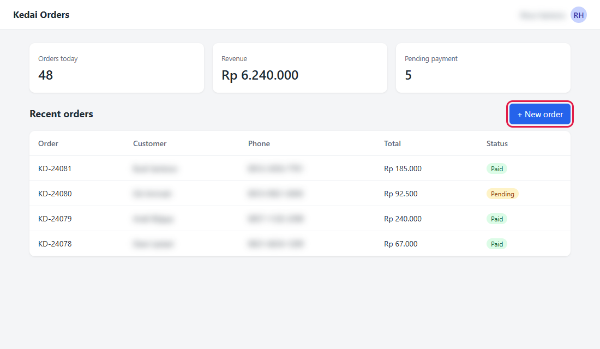

# GuShot

[](https://github.com/rombyar/gushot/actions/workflows/test.yml)

[English](README.md) · **Bahasa Indonesia**

GuShot (Guide User Shot) membuat screenshot untuk buku panduan aplikasi web. Halaman, login, dan klik ditulis di satu file JSON, lalu satu perintah memotret semuanya dengan ukuran yang sama. Kalau tampilan aplikasi berubah, cukup jalankan ulang, tidak perlu memotret manual lagi.

Alat ini dikemas sebagai [Agent Skill](https://agentskills.io) di [`skills/guide-screenshots/`](skills/guide-screenshots/), jadi bisa dipakai lewat agen AI atau langsung:

1. **Plugin Claude Code**
   ```
   /plugin marketplace add rombyar/gushot
   /plugin install gushot@gushot
   ```
   Lalu di proyek mana pun: `/guide-screenshots buatkan screenshot halaman login dan dasbor`.
2. **Agen AI lain yang mendukung Agent Skills**: salin folder `skills/guide-screenshots/` ke folder skill agen itu (lihat dokumentasinya). Folder ini berdiri sendiri.
3. **CLI biasa**, tanpa AI:
   ```bash
   npm install --omit=dev --prefix skills/guide-screenshots/scripts
   node skills/guide-screenshots/scripts/shot.cjs proyek-saya.json            # semua shot
   node skills/guide-screenshots/scripts/shot.cjs proyek-saya.json 03 login   # hanya nama yang mengandung "03" atau "login"
   ```

Butuh Node 18+ dan Chrome atau Edge (dicari otomatis, atau isi `"chrome"` / env `CHROME_PATH`).

Rahasia jangan ditulis di JSON: `{{NAMA_ENV}}` diisi dari environment (`APP_PASSWORD=rahasia node ...`, atau `$env:APP_PASSWORD='rahasia'` di PowerShell).

## Demo

Folder [`demo/`](demo/) berisi aplikasi pesanan sederhana dalam satu file HTML beserta config untuk memotretnya. Nama pelanggan, nomor HP, dan nama pengguna yang login di-blur, dan tombol yang dibahas di panduan diberi kotak merah:



Config-nya login, membaca OTP dari file log, lalu mengambil empat screenshot (login, dasbor, modal New order, dan tampilan ukuran HP). Coba sendiri:

```bash
cd demo
DEMO_PASSWORD=demo node ../skills/guide-screenshots/scripts/shot.cjs gushot.json
```

## Bahasa

- Kunci config utama berbahasa Inggris. Kunci bahasa Indonesia (`buka`, `ketik`, `klik`, `sorot`, ...) tetap diterima: [tabel alias](skills/guide-screenshots/references/aliases-id.md).
- Pesan terminal bahasa Indonesia: `"lang": "id"` (atau `"bahasa": "id"`) di config, atau env `SHOT_LANG=id`.
- Skill membalas dalam bahasa pengguna.

Daftar lengkap kunci dan langkah: [references/REFERENCE.md](skills/guide-screenshots/references/REFERENCE.md) (bahasa Inggris).

## Uji mandiri

```bash
node test/run.cjs
```

Menjalankan config uji berbahasa Inggris dan Indonesia terhadap halaman HTML lokal. Masing-masing sengaja berisi satu shot yang gagal dan satu kunci yang salah ketik, supaya keduanya ikut teruji. CI menjalankannya setiap push.

## Tips

- Pakai data contoh (seeder), jangan data asli. Tetap blur data sensitif.
- CSS tidak termuat: URL dasar aplikasi (mis. `APP_URL`) harus sama dengan `base`.
- Shot gagal tidak menghentikan yang lain; exit code 1 bila ada yang gagal.
