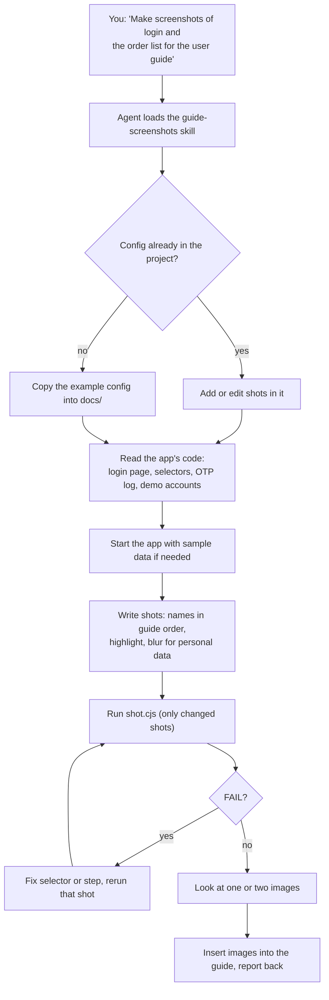

# 5. Using it with an AI agent

GuShot ships as an Agent Skill. With it installed, you ask an AI coding agent for screenshots in plain words, and the agent does the work of tutorials 1 to 4: it reads your app, writes the config, runs it, and checks the result.

## What the agent does



The skill tells the agent to use GuShot instead of taking screenshots by hand or writing its own browser script, to keep passwords in environment variables, and to blur personal data.

## Install

### Claude Code

```
/plugin marketplace add rombyar/gushot
/plugin install gushot@gushot
```

### Codex, GitHub Copilot, Cursor, Gemini CLI

Copy the skill folder into `~/.agents/skills/`, which all four read:

```bash
git clone https://github.com/rombyar/gushot.git
mkdir -p ~/.agents/skills
cp -r gushot/skills/guide-screenshots ~/.agents/skills/
```

```powershell
git clone https://github.com/rombyar/gushot.git
New-Item -ItemType Directory -Force "$HOME\.agents\skills" | Out-Null
Copy-Item -Recurse gushot\skills\guide-screenshots "$HOME\.agents\skills\"
```

Gemini CLI can also install it directly:

```bash
gemini skills install https://github.com/rombyar/gushot.git --path skills/guide-screenshots
```

The [main README](../../README.md#using-it-with-an-ai-agent) lists the folder each agent reads and how to call the skill.

## Example requests

Open your app's project in the agent and ask:

| You want | Ask |
|---|---|
| A first set of screenshots | "Use guide-screenshots to capture the login page, the dashboard, and the new order form for the user guide in docs/guide.md." |
| One step explained with numbers | "Screenshot the new order modal with the customer, item, quantity, and save button numbered 1 to 4." |
| A phone version | "Add phone-size versions of the dashboard and order list." |
| An update after a redesign | "The header changed. Check which guide screenshots are broken or changed and update them." |
| Indonesian | "Buatkan screenshot halaman login dan dasbor untuk buku panduan, nama file pakai bahasa Indonesia." |

In Claude Code you can also start with the command: `/guide-screenshots capture the login page and the dashboard`.

## What to check afterwards

- The agent reports how many shots succeeded and which files it wrote.
- It tells you if it changed environment files such as `.env` (for example to send mail to a log), and restores them.
- Open a few images yourself: logged in, styled, personal data blurred.

## Where it cannot work

The agent has to run commands on the machine where your app runs, or one that can reach it. Chat assistants that run in a cloud sandbox cannot open your `localhost` and have no Chrome.

Back to the [docs index](../README.md).
