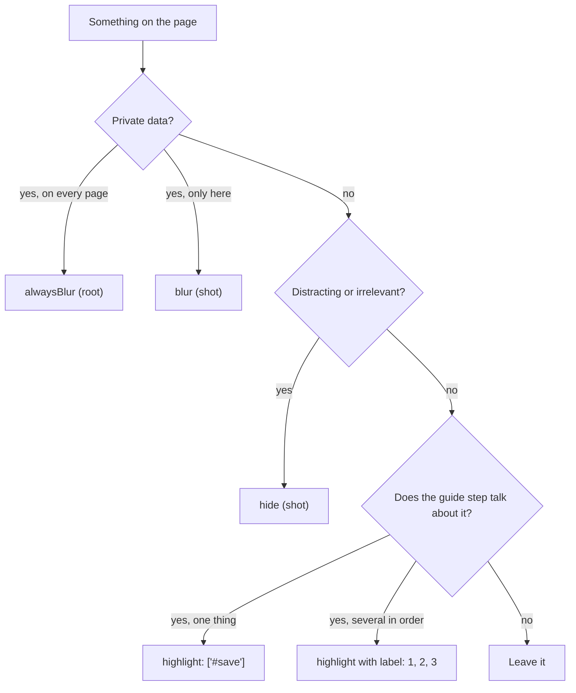
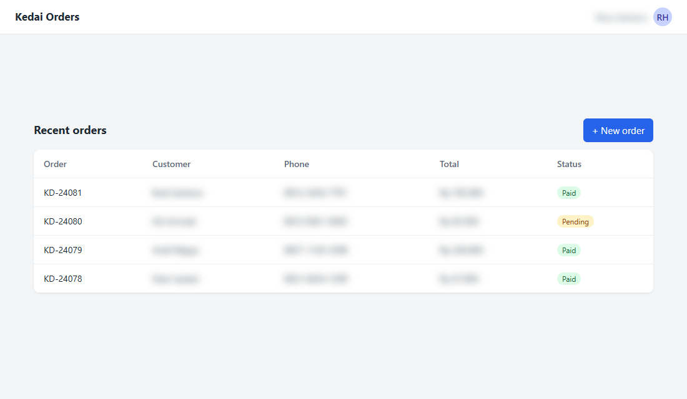
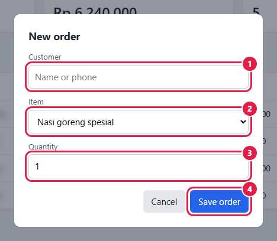

# 3. Blur, hide, highlight, number

A guide screenshot has two jobs: show the reader where to look, and show nothing private. This tutorial covers the keys that do both.

## Which key to use



## The config

[example.json](example.json) logs in like tutorial 2 and takes three shots:

```json
"alwaysBlur": [".customer", ".phone", ".contact"],
"shots": [
  { "name": "01_highlight_button", "session": "admin", "highlight": ["#new-order"] },
  { "name": "02_hide_stats", "session": "admin", "hide": [".stats"], "blur": ["td:nth-child(4)"] },
  { "name": "03_numbered_form", "session": "admin",
    "steps": [{ "click": "#new-order" }, { "wait": ".modal" }],
    "element": ".modal", "padding": 24,
    "highlight": [
      { "selector": "#cust", "label": "1" },
      { "selector": "#menu", "label": "2" },
      { "selector": "#qty", "label": "3" },
      { "selector": ".modal .primary", "label": "4" }
    ] }
]
```

```bash
cd docs/annotations
APP_PASSWORD=demo node ../../skills/guide-screenshots/scripts/shot.cjs example.json
```

## One red box

`"highlight": ["#new-order"]` draws a red box around the button. Use it when the guide says "click New order".


## Hide and blur in one shot

`"hide": [".stats"]` removes the summary cards but keeps their space, so the layout does not jump. `"blur": ["td:nth-child(4)"]` blurs the Total column in this shot only, on top of the names and phone numbers from `alwaysBlur`.



## Numbered steps, only the modal

The guide text for this image can be:

> 1. Enter the customer's name or phone. 2. Choose the item. 3. Set the quantity. 4. Click **Save order**.

`element` captures only the modal, `padding: 24` keeps 24 px of the page around it so the reader sees it is a dialog, and each `label` puts a number on the box.



## Tips

- Blur what is personal even with sample data. Readers copy what they see.
- `alwaysBlur` belongs in the config once; do not repeat it in every shot.
- Change the box color with `"highlightColor": "#2563eb"` and the blur radius with `"blurStrength": 8`.
- Labels can be any short text: `"A"`, `"2a"`, `"✓"`.

Next: [4. Keeping screenshots current](../maintenance/update-after-ui-change.md)
