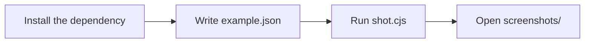
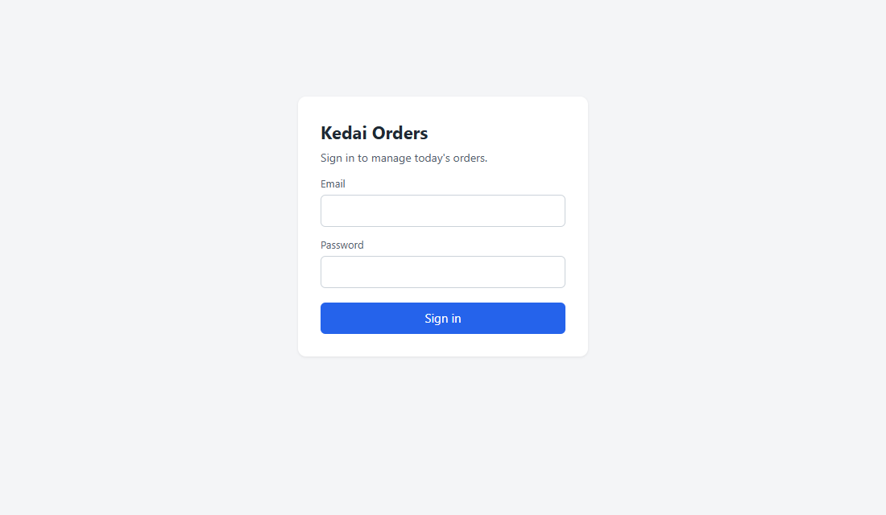
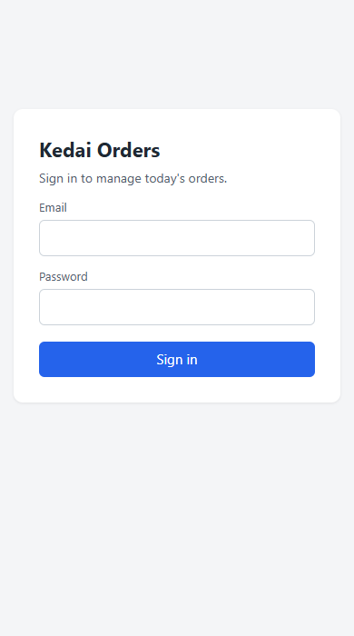

# 1. Your first screenshots

In this tutorial you capture a login page at desktop and phone size. It takes about five minutes.



## Before you start

- Node.js 18 or newer: `node --version`
- Chrome or Edge installed
- The repo cloned: `git clone https://github.com/rombyar/gushot.git`

## Step 1: install the dependency

From the repo root:

```bash
npm install --omit=dev --prefix skills/guide-screenshots/scripts
```

This installs `puppeteer-core`, which drives the browser you already have. It does not download another one.

## Step 2: write a config

A config is a JSON file. This one is [example.json](example.json) in this folder:

```json
{
  "out": "screenshots",
  "viewport": { "width": 1100, "height": 640 },
  "shots": [
    { "name": "01_login_page", "url": "../../demo/app.html" },
    { "name": "02_login_page_mobile", "url": "../../demo/app.html", "viewport": { "width": 390, "height": 700 } }
  ]
}
```

| Key | Meaning |
|---|---|
| `out` | folder for the PNG files, relative to the config file |
| `viewport` | browser size for every shot |
| `shots` | the screenshots, in the order of your guide |
| `name` | file name without `.png`; number them so they sort in guide order |
| `url` | the page. Here it is a local file; for a real app use `"base": "http://localhost:3000"` at the top and `"url": "/login"` |
| `viewport` inside a shot | a different size for that shot only |

## Step 3: run it

```bash
cd docs/getting-started
node ../../skills/guide-screenshots/scripts/shot.cjs example.json
```

```
OK    screenshots/01_login_page.png (new)
OK    screenshots/02_login_page_mobile.png (new)

Done: 2 OK, 0 failed. Output in .../docs/getting-started/screenshots
Changed: 0, new: 2.
```

## Result

| `01_login_page.png` | `02_login_page_mobile.png` |
|---|---|
|  |  |

## Try this

- Add `"fullPage": true` to a shot to capture the whole scrolling page.
- Run only one shot: `node ... example.json mobile` (any part of the name works).
- Add `"headless": false` at the top to watch the browser.
- Add `"scale": 2` at the top for sharp images in a PDF.

## For your own app

Start the app with sample data, then replace `url` with your pages:

```json
{
  "base": "http://localhost:3000",
  "out": "docs/images",
  "shots": [
    { "name": "01_home", "url": "/" },
    { "name": "02_pricing", "url": "/pricing", "fullPage": true }
  ]
}
```

Next: [2. Logging in, with OTP](../login/login-and-otp.md)
