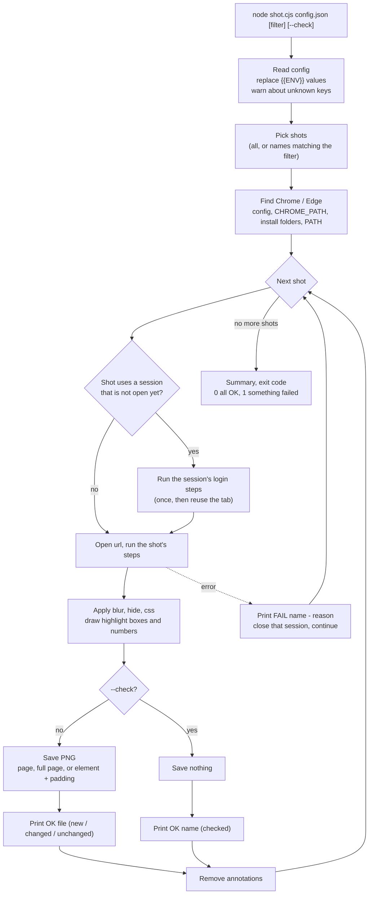
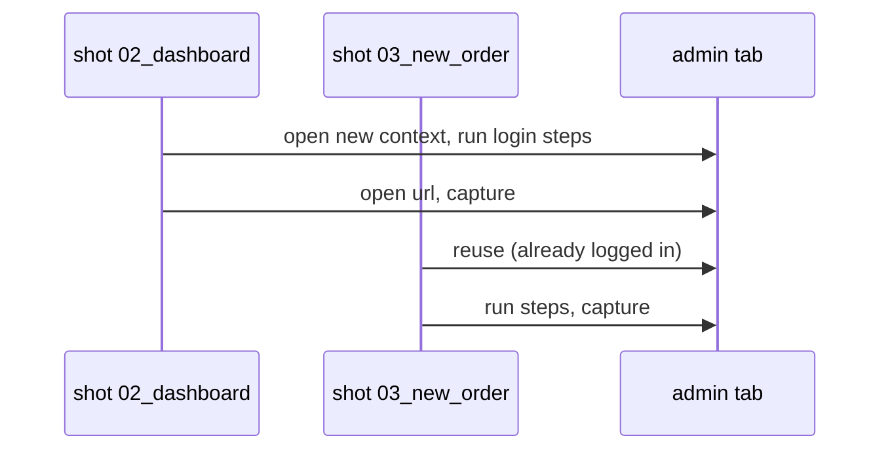

# How GuShot works

GuShot reads one JSON config and drives your installed Chrome or Edge through it. You never write browser code; you describe pages and steps, and GuShot turns them into PNG files.

## The whole run

## Three ideas to keep in mind

**Sessions log in once.** A session is a list of login steps. The first shot that names it runs those steps in a fresh browser context; later shots reuse the logged-in tab. A shot with `"freshSession": true` logs in again first. If a shot fails, its session is closed so the next shot starts clean.

**Paths are relative to the config file.** `out`, `otp.file`, a `run` step's `cwd`, a local page like `"./app.html"`, and `chrome` all resolve from the folder that holds the config, not from where you run the command.

**Annotations are temporary.** Blur, hidden elements, highlight boxes, and numbers are added right before the capture and removed right after, so they never leak into the next shot.

Next: [1. Your first screenshots](../getting-started/first-screenshots.md)
