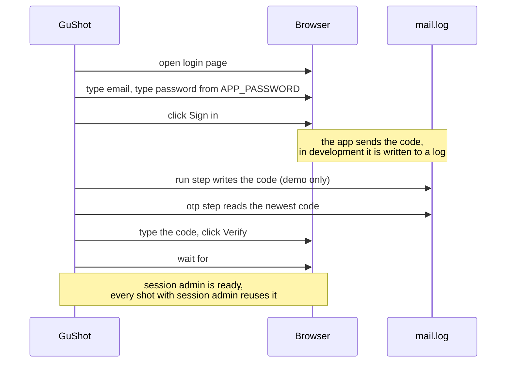
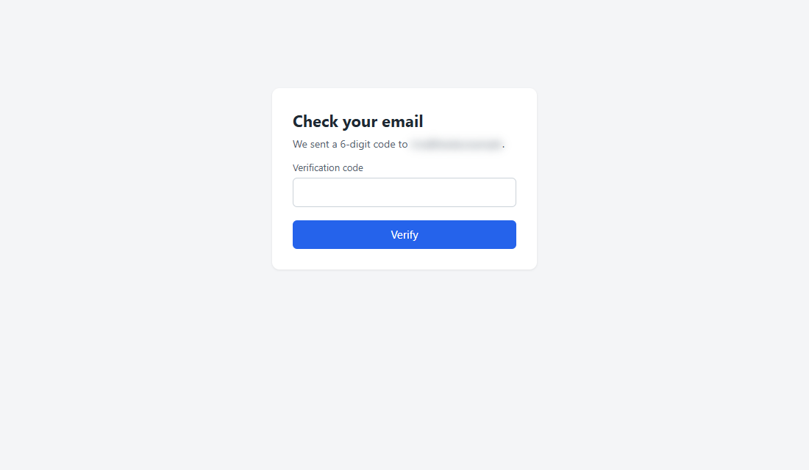
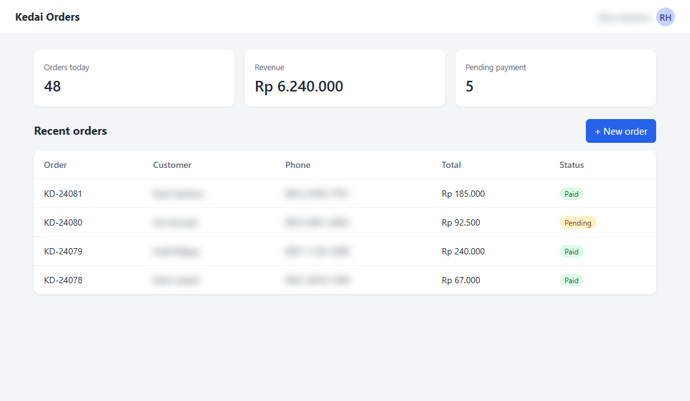
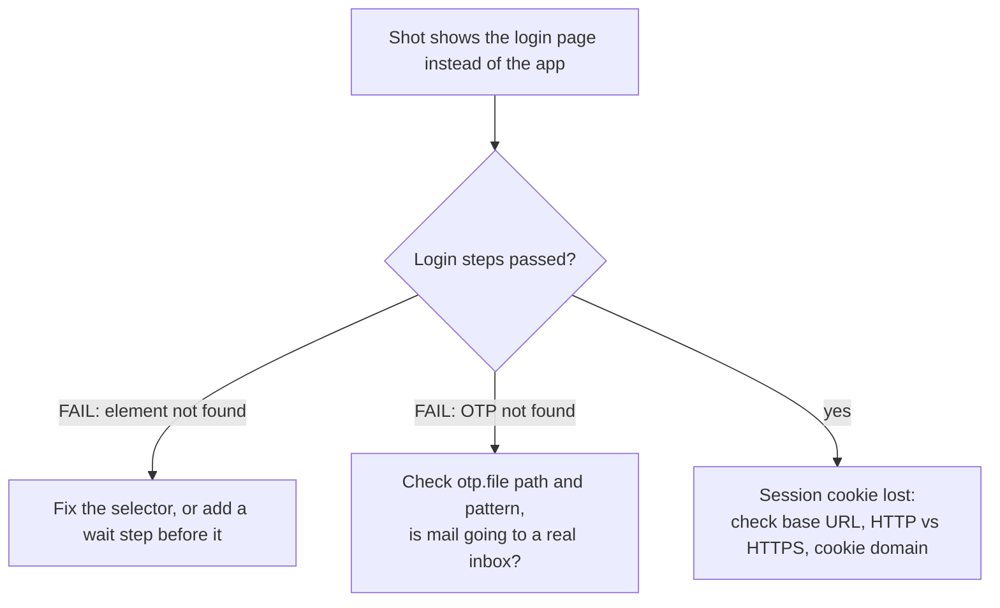

# 2. Logging in, with OTP

Most guide pages are behind a login. In this tutorial you log in once with a password from the environment, enter a one-time code that the app writes to a log file, and capture pages as the logged-in user.

## The login flow



## The config

[example.json](example.json) in this folder:

```json
{
  "out": "screenshots",
  "viewport": { "width": 1100, "height": 640 },
  "alwaysBlur": [".customer", ".phone", ".contact"],
  "sessions": {
    "admin": [
      { "open": "../../demo/app.html" },
      { "type": "#email", "text": "rina@kedai.example" },
      { "type": "#password", "text": "{{APP_PASSWORD}}" },
      { "click": "#login button" },
      { "run": "node -e \"require('fs').appendFileSync('mail.log','Your Kedai code: 482913\\n')\"" },
      { "otp": { "file": "mail.log", "pattern": "Kedai code: (\\d{6})", "into": "#code", "submit": { "clickText": "Verify" } } },
      { "wait": "#app" }
    ]
  },
  "shots": [
    { "name": "01_otp_page", "url": "../../demo/app.html", "steps": [
      { "type": "#email", "text": "rina@kedai.example" },
      { "type": "#password", "text": "{{APP_PASSWORD}}" },
      { "click": "#login button" },
      { "wait": "#code" }
    ] },
    { "name": "02_dashboard", "session": "admin" }
  ]
}
```

What each part does:

- **`sessions.admin`** is the login, written once. Name sessions after roles (`admin`, `cashier`, `customer`) when your guide covers several.
- **`{{APP_PASSWORD}}`** is replaced with the `APP_PASSWORD` environment variable. Passwords never go in the file.
- **`run`** writes a code to `mail.log`. The demo app has no mail server, so this stands in for it. In your app you leave this step out, because the app writes the code itself.
- **`otp`** waits for a line matching `pattern` in `file`, takes capture group 1 (the `(\d{6})` part), types it into `into`, and runs `submit`. It only reads lines written after the previous step, so an old code is never reused.
- **`01_otp_page`** has no session: it shows the page between password and code, so the guide can explain that step.
- **`02_dashboard`** uses the session, so it starts already logged in.

## Run it

```bash
cd docs/login
APP_PASSWORD=demo node ../../skills/guide-screenshots/scripts/shot.cjs example.json
```

PowerShell: `$env:APP_PASSWORD='demo'; node ../../skills/guide-screenshots/scripts/shot.cjs example.json`

## Result

| `01_otp_page.png` | `02_dashboard.png` |
|---|---|
|  |  |

The email address, customer names, phone numbers, and user name are blurred by `alwaysBlur`. Tutorial 3 covers that.

## For your own app

1. **Find the real selectors.** Open the login page, right-click the email field, and choose Inspect. Prefer `#id` or `[name=email]` over long class chains.
2. **Find where the code goes in development.** Laravel with `MAIL_MAILER=log` writes mail to `storage/logs/laravel.log`; many apps print it to the console log. Point `otp.file` there and write a `pattern` that matches the line, for example `"Your code is (\\d{6})"`.
3. **Make the app's base URL match `base`.** If the app thinks it lives at another host, its CSS and cookies break.
4. **Watch out for login rate limits.** Add a `run` step that clears the limiter (for example `php artisan cache:clear`) at the start of the session.



Next: [3. Blur, hide, highlight, number](../annotations/blur-highlight-numbering.md)
