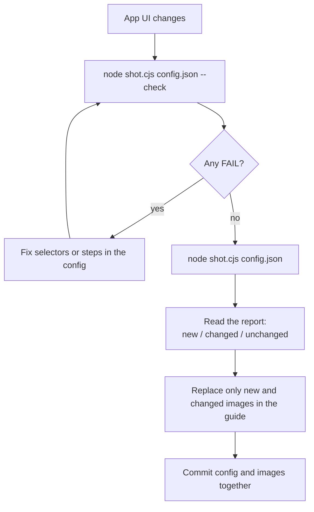
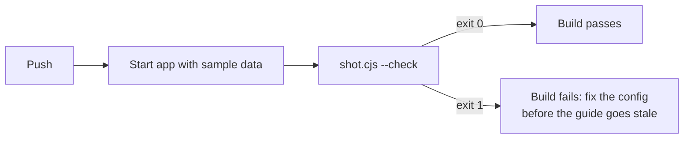

# 4. Keeping screenshots current

The point of a config over manual screenshots is the second run. When the app changes, you rerun GuShot instead of retaking every image. This tutorial shows how to find what changed, update only those images, and catch broken selectors before they reach the guide.

## The update cycle



## Step 1: check without saving

`--check` runs every login and step and confirms each `element` exists, but writes no files. Your current images stay untouched while you fix things.

```bash
cd docs/annotations
APP_PASSWORD=demo node ../../skills/guide-screenshots/scripts/shot.cjs example.json --check
```

```
OK    01_highlight_button (checked, not saved)
OK    02_hide_stats (checked, not saved)
OK    03_numbered_form (checked, not saved)

Done: 3 OK, 0 failed. Output in .../docs/annotations/screenshots
```

If a selector broke, you get a `FAIL` line with the reason and exit code 1:

```
FAIL  03_numbered_form - element .modal not found
```

## Step 2: capture and read the report

To see a real change, open [../../demo/app.html](../../demo/app.html) in an editor and change the heading `Recent orders` to `Latest orders`. Then capture:

```bash
APP_PASSWORD=demo node ../../skills/guide-screenshots/scripts/shot.cjs example.json
```

```
OK    screenshots/01_highlight_button.png (changed)
OK    screenshots/02_hide_stats.png (changed)
OK    screenshots/03_numbered_form.png (unchanged)

Done: 3 OK, 0 failed. Output in .../docs/annotations/screenshots
Changed: 2, new: 0.
```

Each file is compared with the one it replaces. The two dashboard shots show the new heading, so those are the images to replace in the guide. `03_numbered_form.png` is unchanged because the modal covers the heading. If you keep the images in git, `git diff --stat` shows the same list.

Undo the edit afterwards (`git checkout demo/app.html`) and run again to restore the images.

## Step 3: rerun only what you touched

A filter runs only shots whose name contains the text:

```bash
APP_PASSWORD=demo node ../../skills/guide-screenshots/scripts/shot.cjs example.json 03          # only 03_numbered_form
APP_PASSWORD=demo node ../../skills/guide-screenshots/scripts/shot.cjs example.json button hide  # 01 and 02
```

## Catch breakage in CI

Run `--check` on every push, so a renamed button fails the build instead of silently breaking the guide later. A GitHub Actions job, assuming your app can start in CI with sample data:

```yaml
- run: npm ci && npm run seed && npm start &
- run: npx wait-on http://localhost:3000
- run: npm install --omit=dev --prefix path/to/guide-screenshots/scripts
- run: node path/to/guide-screenshots/scripts/shot.cjs docs/screenshots.json --check
  env:
    APP_PASSWORD: ${{ secrets.DOCS_DEMO_PASSWORD }}
```



## Exit codes

| Code | Meaning |
|---|---|
| `0` | every shot OK |
| `1` | at least one shot failed; the others still ran |
| `2` | `puppeteer-core` is not installed; the message shows the install command |

Next: [5. Using it with an AI agent](../ai-agents/use-with-ai-agents.md)
